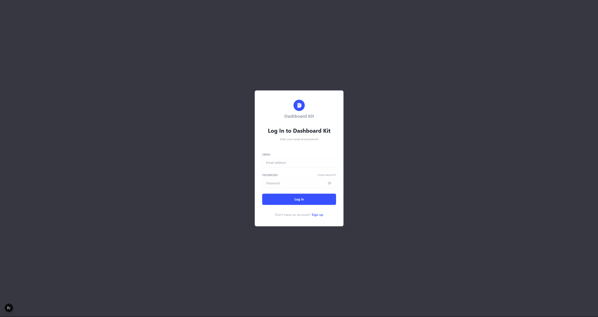
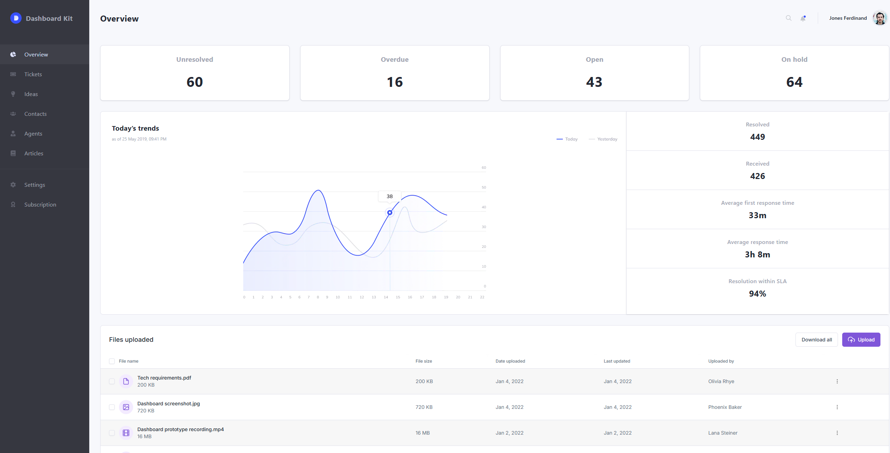

# Dashboard Kit

Una UI de Next.js y TailwindCSS para una página de login y un dashboard.

---

## Prerrequisitos

- **Node.js** v20 o superior
- **npm** o **yarn**

---

## Cómo empezar

1. **Clonar el repositorio**
   ```bash
   git clone https://github.com/JorgeToT/dashboard-kit-ui
   cd dashboard-kit
   ```

2. **Instalar dependencias**
   ```bash
   npm install
   # o
   yarn install
   ```

3. **Ejecutar en modo desarrollo**
   ```bash
   npm run dev
   # o
   yarn dev
   ```
   Abre [http://localhost:3000](http://localhost:3000) en tu navegador.

---

## Estructura del proyecto

```plaintext
src/
├── app/
│   ├── login/page.tsx     # Página de login
│   ├── dashboard/page.tsx # Página principal
│   └── globals.css        # Estilos globales
├── components/
│   ├── dashboard/         # Componentes del dashboard
│   ├── login/             # Componentes específicos de login
│   ├── table/             # Componentes compartidos (Button, InputField)
│   └── ui/                # Componentes generados por shadcn/ui
├── data/                  # Información mostrada en los diferentes componentes
├── hooks/                 # Hooks personalizados
├── utils/                 # Funciones utilitarias
└── types/                 # Tipos de TypeScript

public/
└── images/                # Assets exportados de Figma

styles/
└── globals.css            # Estilos globales
```  

---

## Scripts disponibles

- `npm run dev` — Inicia el servidor en modo desarrollo
- `npm run build` — Genera el build de producción
- `npm run start` — Ejecuta el build de producción
- `npm run lint` — Ejecuta ESLint
- `npm run format` — Ejecuta Prettier

---

## Capturas de pantalla



---

## Limitaciones conocidas y TODOs

- Gráficas en el dashboard usan imagenes